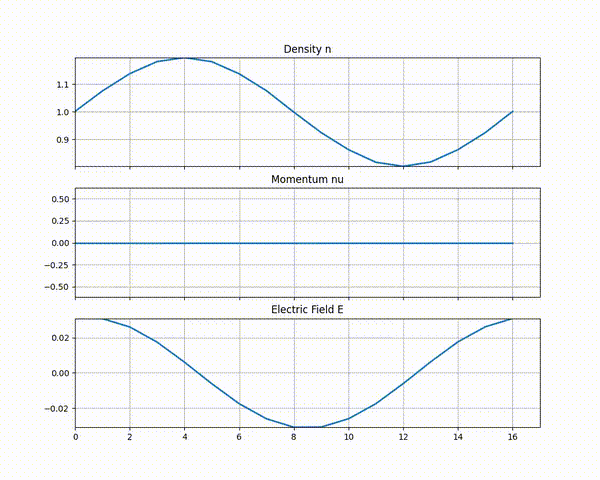

# Vlasov-Ampère solvers

<!--

-->
#### Authorship
The solvers implemented in this project are slightly improved versions of those implemented in the 2022 Final Year Project for MEng Aeronautical Engineering, Imperial College by William Denny. The background details provided here have been have been lifted from the project report. 

## Table of Contents
- [Usage](#usage)
- [Background](#background)
- [Requirements](#requirements)

<!-- <!-- mkdir build && cd build -->


## Usage

To begin simply clone the repository
```bash
git clone https://github.com/greenvale/vlasov-ampere.git
cd vlasov-ampere
```
### Explicit solver
The explicit solver is implemented by using a ``Species`` class to encapsulate the particle species and solve for their density, momentum, position and velocity. The electric field is then solved seperately and is propagated to each species during each time step.

To run the explicit code on the Landau damping test case, build and run:
```
cd explicit
make
./main
```

The data for density, momentum and electric field will be saved in csv files in the working directory. A python animation of this is provided in `plot.py`. You can view this animation by running:

```
py plot.py
```

You should see something like this:



## Background
The Vlasov-Amp&egrave;re system of equations can be solved to simulate the behaviour of plasma. This project is concerned with implementing System 2.4 of the Project NEPTUNE specification: solving the Vlasov-Amp&egrave;re system of equations using the kinetic-enslaved particle-in-cell (PIC) implicit moment method (IMM). The Vlasov-Amp&egrave;re equations characterise the velocity distribution of plasma charge carriers, which are solved using the PIC method by simulating charge carriers as 'super particles'.

### Theory

We provide some technical details about electromagnetism that are relevant in the construction of the kinetic-enslaved PIC IMM model. In a plasma of charged particles coupled with an electromagnetic field, a single particle will experience a Lorentz force from the electrostatic and magnetic components of field, given by

$$ \mathbf{F} = q_p \mathbf{E} + q_p(\mathbf{v_p} \times \mathbf{B}), \qquad (1) $$

where $\mathbf{F}$ is the force vector, $\mathbf{E}$ is the electric field vector, $\mathbf{B}$ is the magnetic field vector, $\mathbf{v_p}$ is the velocity vector $q_p$ is the particle charge. One consequence of (1) is that the magnetic field will not exert a force on a particle with velocity
 parallel to its field lines. In tokamak fusion reactors, a magnetic field is used to direct plasma flow
 around a circular path. In equilibrium, the plasma flow is parallel to the field lines, meaning the force
 exerted by the magnetic field can be neglected [2].

Maxwell's equations describe the dynamics of electromagnetic fields using the moment quantities of charged particles, that is, charge density $\rho$ and current vector $\mathbf{j}$. These are given by

$$ \nabla \cdot \mathbf{E} = \frac{\rho}{\epsilon_0} \quad (2) \qquad \nabla \times \mathbf{E} = -\mu_0 \frac{\partial \mathbf{B}}{\partial t} \quad (3) $$
$$ \nabla \cdot \mathbf{B} = 0 \quad (4) \qquad \nabla \times \mathbf{B} = -\mu_0 \mathbf{j} + \mu_0 \epsilon_0 \frac{\partial \mathbf{E}}{\partial t} \quad (5) $$

The electric field $\mathbf{E}$ can be expressed as the gradient vector field of the electric potential $\phi$, in equation (6). (2) can then be written in terms of $\phi$ to get the Poisson equation (7):

$$\mathbf{E} = -\nabla \phi \quad (6) \qquad \nabla^2 \phi = -\frac{\rho}{\epsilon_0} \quad (7)$$

(4) is known as the Amp&egrave;re equation. By neglecting magnetic field, the Amp&egrave;re the equation can be expressed by (8).

$$ \epsilon_0 \frac{\partial \mathbf{E}}{\partial t} + \mathbf{j} - \langle \mathbf{j} \rangle \quad (8) \qquad \mathbf{j} = q_\alpha \mathbf{nu} \quad (9)$$

$\mathbf{nu}$ is the charge-normalised current, also referred to in [1] as the number-momentum or momentum. Moreover $n$ is the charge-normalised density, that is, $\rho = q n$, and is referred to in [1] as number density or density.

The velocity distrbution function of a plasma $f(\mathbf{x},\mathbf{v},t)$ is the probability distribution function over $\mathbb{R}^3$ in the velocity space. More precisely, $f$ quantifies the probability that a particle at location $\mathbf{x}$ at time $t$ has velocity $\mathbf{v}$. Most gases usually have a Maxwell-Boltzmann velocity distribution that is invariant with time. However, plasmas coupled to electromagnetic fields have a velocity distribution that evolves with time according to the Vlasov equation. In the case that we neglect the magnetic field, the Vlasov equation in 1D is:

$$\frac{\partial f}{\partial t} + v \frac{\partial f}{\partial x} + \frac{q}{m} E \frac{\partial f}{\partial v}, \qquad (10)$$

where $m$ is the particle mass. Taking the zeroth and first moments of the Vlasov equation returns the continuity and momentum conservation equations:

$$ \frac{\partial n}{\partial t} + \frac{\partial (nu)}{\partial x} = 0 \quad (11) \qquad 
\frac{\partial (nu)}{\partial t} + \frac{\partial S}{\partial x} - \frac{q}{m} n E \quad (12)

$$

(11) and (12) are then combined with (8) to get the Vlasov-Amp&egrave;re system of equations as given in [1]. 

### PIC IMM Model

The PIC model represents the velocity distribution as a collection of super particles. In [1], there is an lower-order (LO) system of density, momentum and electric field discretised over a mesh of cells. The higher-order (HO) system is the collection of super particles. The LO system is solved implicitly to obtain the electric field and estimates of the density and momentum. The HO system is solved by integrating the Vlasov equation in the Lagrangian frame of reference for each super particle $p$:

$$\frac{\partial v_p}{\partial t} = \frac{q}{m} E_p \quad (13) \qquad \frac{\partial x_p}{\partial t} = v_p \quad (14) $$

We solve the LO system by solving for $n^{LO}$, $\overline{nu}^{LO}$ and $E^{LO}$. $\overline{nu}$ is the 'time-averaged' momentum which is solved for at time steps $k+\frac{1}{2}$. The time averaged aspect is because in the HO system, the average momentum is accumulated throughout the pushing of the particles, which consists of multiple sub-cycle pushes. The LO system approximates this time averaged momentum with $\overline{nu}$. The density of time-averaged momentum are LO estimates of the HO true values. We need consistency between LO and HO values. [1] achieves this using the consistency parameter $\gamma$. 

We assume that there is only one species present. To solve the LO quantities $n^{LO}$, $\overline{nu}^{LO}$, $E^{LO}$, [1] introduces the density normalised-stress tensor $\tilde{S}$ calculated from HO system. We arrive at the following equations

$$ \frac{\partial n^{LO}}{\partial t} + \frac{\partial}{\partial x}{nu^{LO}} = 0 \qquad (15)$$
$$\frac{\partial }{\partial t}nu^{LO} +  \frac{\partial }{\partial x}n^{LO}\tilde{S}^{HO} - \frac{q}{m}n^{LO}E = \gamma^{HO}_{nu} n^{LO} \qquad (16)$$
$$ \epsilon_0 \frac{\partial E}{\partial t} + q \, {nu}^{LO} - \langle q \, {nu}^{LO} \rangle = 0 \qquad (17)$$

We follow the discretisation in [1], where momentum and electric field are calculated at cell walls, which are indexed $i+\frac{1}{2}$ for $i=1,\dots,n$ and density and stress are calculated at cell centres, indexed $i$ for $i=1,\dots,n$. 

The first equation in the LO system is

$$ \frac{n^{LO,k+1}_{i} - n^{HO,k}_{i}}{\Delta t} 
+ \frac{\overline{nu}^{LO,k+\frac{1}{2}}_{i+\frac{1}{2}} - \overline{nu}^{LO,k+\frac{1}{2}}_{i-\frac{1}{2}}}{\Delta x} = 0,
\qquad (18)
$$
where we solve for $n^{LO, k+1}_{i}$ for $i=1,\dots,n$ and $\overline{nu}^{LO, k+\frac{1}{2}}_{i+\frac{1}{2}}$ for $i = 0,\dots,n$. For the next equation we have
$$ \frac{ \overline{nu}^{LO, k+\frac{1}{2}}_{i+\frac{1}{2}} - nu^{HO,k}_{i+\frac{1}{2}}}{\Delta t / 2}
+ \frac{n^{LO,k+\frac{1}{2}}_{i+1} \tilde{S}^{HO,k+\frac{1}{2}}_{i+1} - n^{LO,k+\frac{1}{2}}_{i} \tilde{S}^{HO,k+\frac{1}{2}}_{i}}{\Delta x}
- \frac{q}{m}n^{LO, k+\frac{1}{2}}_{i+\frac{1}{2}} E^{LO, k+\frac{1}{2}}_{i+\frac{1}{2}}$$
$$- \gamma^{HO}_{nu,i+\frac{1}{2}} n^{LO,k+1}_{i+\frac{1}{2}} = 0, \qquad (19)
$$

where spatially- or temporally-midpoint density/electric field values are calculated from $$n^{LO,k+\frac{1}{2}}_{i} = \frac{1}{2}(n^{LO,k}_{i} + n^{LO,k+1}_{i})$$ $$n^{LO,k+\frac{1}{2}}_{i+1} = \frac{1}{2}(n^{LO,k}_{i+1} + n^{LO,k+1}_{i+1})$$ $$n^{LO,k+\frac{1}{2}}_{i+\frac{1}{2}} = \frac{1}{4}(n^{LO,k}_{i} + n^{LO,k+1}_{i} + n^{LO,k}_{i+1} + n^{LO,k+1}_{i+1})$$ $$E^{LO,k+\frac{1}{2}}_{i+\frac{1}{2}} = \frac{1}{2}(E^{LO,k}_{i+\frac{1}{2}} + E^{LO,k+1}_{i+\frac{1}{2}})$$
and we are looking to solve for $n^{LO,k+1}_{i}$, $\overline{nu}^{k+\frac{1}{2}}_{i+\frac{1}{2}}$ and $E^{LO, k+1}_{i+\frac{1}{2}}$.
Finally the Amp&egrave;re equation is solved via

$$
\epsilon_0 \frac{E^{LO, k+1}_{i+\frac{1}{2}} - E^{LO, k}_{i+\frac{1}{2}}}{\Delta t} - q \, \overline{nu}^{LO, k+\frac{1}{2}}_{i+\frac{1}{2}} - \langle q\, \overline{nu}^{LO, k+\frac{1}{2}}_{i+\frac{1}{2}} \rangle = 0, \qquad (20)
$$
where we are solving for $\overline{nu}^{k+\frac{1}{2}}_{i+\frac{1}{2}}$ and $E^{LO, k+1}_{i+\frac{1}{2}}$.

The formulas for the density-normalised stress tensor $\tilde{S}$ and consistency parameter $\gamma$ are given by

$$ \tilde{S}_{i}^{HO, k+\frac{1}{2}} = \frac{S^{HO, k}_{i} + S^{HO, k+1}_{i}}{n^{HO, k}_{i} + n^{HO, k+1}_{i}} \qquad (21)$$

$$ \gamma^{HO}_{nu, i+\frac{1}{2}} = \frac{1}{n^{HO, k+1}_{i+\frac{1}{2}}}\left( 
\frac{ \overline{nu}^{HO, k+\frac{1}{2}}_{i+\frac{1}{2}} - nu^{HO,k}_{i+\frac{1}{2}}}{\Delta t / 2}
+ \frac{n^{HO,k+\frac{1}{2}}_{i+1} \tilde{S}^{HO,k+\frac{1}{2}}_{i+1} - n^{HO,k+\frac{1}{2}}_{i} \tilde{S}^{HO,k+\frac{1}{2}}_{i}}{\Delta x}
- \frac{q}{m}n^{HO, k+\frac{1}{2}}_{i+\frac{1}{2}} E^{LO, k+\frac{1}{2}}_{i+\frac{1}{2}}
\right) \qquad (22)$$

Note that (22) is derived from (19) by swapping the LO density and time-averaged momentum with the HO counterparts. Note that this is still a function of unknown $E^{LO, k+1}_{i+\frac{1}{2}}$. 

## Requirements

This project requires an NVidia GPU with compute capability &ge; 6.0. CUDA Toolkit &ge; 12.0 must also be installed to run the ``nvcc`` compiler.


### References

[1] Smith, J., et al., *A Fast CUDA Particle Simulator*, Journal of Computational Physics, 2020. [Link](https://doi.org/10.1000/exampledoi)  
[2] Doe, A., *GPU-Accelerated Simulations*, Conference on HPC, 2019. [Link](https://doi.org/10.1001/exampledoi)
